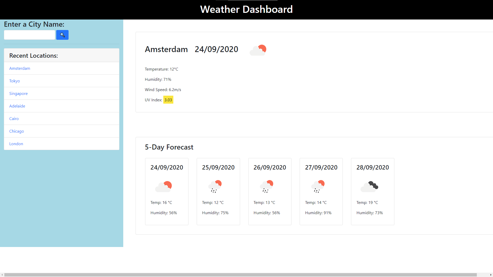

# weather-dashboard
Code written by arbdt on github. I do not claim it as my own
This weather dashboard allows users to make check the current temperature, humidity, wind speed and UV index of a location that they search for.
It also provides a five-day forecast for the same location. Previously entered cities are saved in the sidebar and also in local storage for later access. Clicking on these older entries will call the freshl retrieve the data.

This page makes use of a few of the APIs available from Open Weather Map. It also uses Moment.js for some date manipulation and also jQuery for general purposes.

### Preview Image

### Link to Live Version
[Click here](https://micahdeaton.github.io/weather-dashboard/) to access the deployed website.